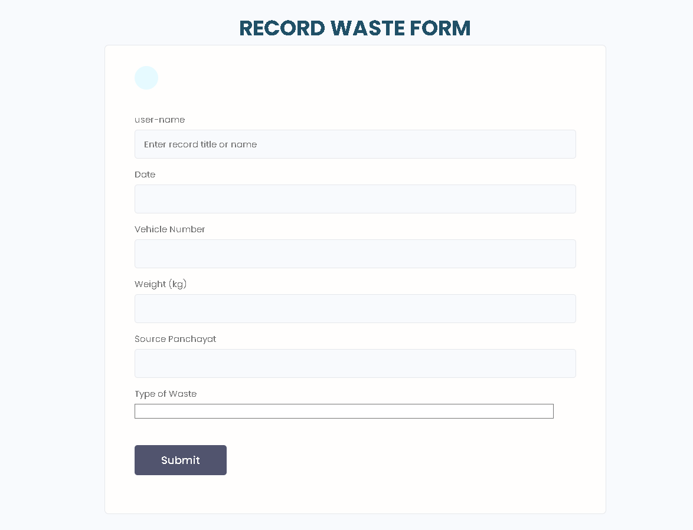

# Digital-MRF-System

## Project-Overview

<p align="center">
  
  <br/>
  
</p>

## Reports-overview 

<p align="center">
  
  <br/>
  
</p>

The Waste Management System is a Django-based web application designed to enhance
efficiency in waste management and promote environmental sustainability.
This application allows users to track waste collection and manage recycling processes.

- 📄 [Download PDF Report](Django-App/static/screenshots/waste_evidence_report.pdf)
- 📊 [Download CSV Report](Django-App/static/screenshots/csv_report.csv)

## Features

- **User Registration and Login: Secure user authentication system.**
- **Waste Collection Tracking: Users can track waste collection and disposal/recycling.**
- **Export data in csv and pdf format**
- **API : built with DRF and simple-jwt**

## Technology Stack

- **Backend: Django (Python)**
- **Database: sqlite**
- **API: Django Rest Framework**
- **Frontend: HTML, CSS**
- **Dependency Management: Poetry**

## Getting Started

These instructions will get you a copy of the project up and running on your local
machine for development and testing purposes.

## Prerequisites

- **Python 3.8+**
- **Poetry (for dependency management)**
- **Django 4.2+**

## Installation

### 1.Clone the repository

- **git clone https://github.com/szaid47/rural-waste-monitor**
- **cd** Django-App

### 2.Set up a Poetry environment

```bash
    poetry shell
    poetry install
```

### 3.Initialize the database

- **create .env file with the variable names from settings.py.**

To generate a new Django secret key use the following command:

```bash
python manage.py shell
from django.core.management.utils import get_random_secret_key
print(get_random_secret_key())
```

```bash
python manage.py migrate
```

### 4.Create a superuser (optional)

```bash
python manage.py createsuperuser
```

### 5.Run the development server

```bash
python manage.py runserver
```

### 6.Access the application

- **Open your web browser and navigate to http://127.0.0.1:8000/.**

## Testing

```bash
python manage.py test
```

## License

- **This project is licensed under the MIT License.**

### Versioning

- ** This application is at version 0.3.2 and subjected to future changes.**

Here’s a quick look at some of the important pages in the Digital MRF System:

### SignUp Page


### Profile Page


### 📄 Waste Record Form



### 📊 Reports Page


